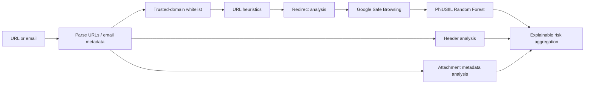

# Hybrid Phishing Email Detection API

An explainable FastAPI backend for assessing phishing risk in URLs, pasted email text, and `.eml` messages. It combines deterministic security checks with a URL-only machine-learning signal and Google Safe Browsing.

## Live demo

- **Web app:** [https://phishguardbymohak.vercel.app/]
- **API health:** [https://phishing-detector-production-2b6e.up.railway.app/health](https://phishing-detector-production-2b6e.up.railway.app/health)
- **Interactive API docs:** [https://phishing-detector-production-2b6e.up.railway.app/docs](https://phishing-detector-production-2b6e.up.railway.app/docs)

## Architecture



## Features

- URL extraction, whitelist checks, and bounded explainable heuristic scoring
- Safe redirect-chain analysis with timeouts, hop limits, relative locations, loop protection, and partial failure results
- Google Safe Browsing lookup via `GOOGLE_SAFE_BROWSING_API_KEY`
- Graceful degradation: unavailable threat intelligence or ML never means safe
- `.eml` parsing with standard-library email parsing
- Header analysis for Reply-To/Return-Path mismatches, impersonation, SPF, DKIM, DMARC, and Received-chain anomalies
- Attachment metadata and SHA-256 inspection without executing or opening attachments
- PhiUSIIL-trained Random Forest model using only features reproducible from a raw URL

## Quick start

```bash
python3 -m pip install -r requirements.txt
```

Create a root `.env` file:

```env
GOOGLE_SAFE_BROWSING_API_KEY=your_key_here
```

Train the local model artifact, then start the API:

```bash
python3 -m src.ml.train_model
uvicorn src.api:app --reload
```

The API listens at `http://127.0.0.1:8000` and allows the local Next.js frontend on ports `3000`.

## Deploy with Docker

The included `Dockerfile` installs dependencies and trains the Git-ignored model inside the image from the local PhiUSIIL CSV. Build it from this backend directory, where `data/PhiUSIIL.csv` is present:

```bash
docker build -t phishing-detector-api .
docker run --rm -p 8000:8000 \
  -e GOOGLE_SAFE_BROWSING_API_KEY='your_key_here' \
  -e CORS_ALLOWED_ORIGINS='https://your-frontend.example.com' \
  phishing-detector-api
```

For a hosted deployment, configure the same two variables in the provider dashboard. Never add `.env` to a container image, source control, or frontend variables. Use the deployed API URL in the frontend's `NEXT_PUBLIC_API_URL` setting.

## API

| Method | Endpoint | Purpose |
| --- | --- | --- |
| `GET` | `/` | Service information |
| `GET` | `/health` | Component health/status |
| `POST` | `/analyze/url` | Analyze one URL |
| `POST` | `/analyze/email` | Analyze URLs in pasted email text |
| `POST` | `/analyze/eml` | Analyze an uploaded `.eml` file |

Example URL request:

```bash
curl -X POST http://127.0.0.1:8000/analyze/url \
  -H 'Content-Type: application/json' \
  -d '{"url":"https://example.com"}'
```

`/analyze/eml` expects `multipart/form-data` with a field named `file`.

## Threat-intelligence semantics

Google Safe Browsing reports whether a URL matches its current threat lists:

- `available: true, malicious: true` — strong malicious signal
- `available: true, malicious: false` — no known list match; **not a safety guarantee**
- `available: false, malicious: null` — unavailable/error; **not safe**

Risk aggregation gives confirmed threat intelligence and strong deterministic evidence priority over ML. Trusted whitelist matches remain authoritative to mitigate known URL-only model bias.

## Machine learning

Dataset: `data/PhiUSIIL.csv` (235,795 rows, 55 columns; 100,945 phishing and 134,850 legitimate records). The original label mapping is `0 = phishing`, `1 = legitimate`.

The production pipeline uses the same URL-only feature generator for training and inference. Selected features include URL/domain/TLD length, IP-domain detection, subdomain count, encoding/obfuscation, character/digit/special-character ratios, query separators, and HTTPS. Label columns, identifiers, dataset probabilities/similarity values, page-content fields, redirect counts, forms, titles, DOM data, and resource counts are excluded because they cannot be safely derived from a raw URL.

Held-out test results from the 70/15/15 stratified split:

| Metric | Result |
| --- | ---: |
| Accuracy | 99.43% |
| Phishing precision | 99.52% |
| Phishing recall | 99.14% |
| F1 | 99.33% |
| ROC-AUC | 99.74% |
| False negatives | 130 |

The serialized model is generated at `src/models/phishing_model.joblib` and is intentionally ignored by Git. Detailed metrics are saved to `src/models/evaluation.json`.

## Test and validate

```bash
python3 -m unittest discover -s tests -v
python3 test_backend.py
python3 test_api.py
python3 -m src.ml.train_model
```

## Security boundaries and limitations

- Attachments are never executed.
- The API does not scrape websites, browser-render URLs, use Selenium, or bypass access controls.
- URL-only ML probabilities are signals, not guarantees. Domain-level bias is mitigated by the trusted whitelist and multi-signal aggregation.
- Google Safe Browsing coverage and external availability can vary; absence of a match must never be interpreted as safe.
- Keep `.env`, raw datasets, local environments, caches, and generated model files out of commits.

## Resume summary

> Built a hybrid phishing email detection API with FastAPI, explainable URL/email risk aggregation, Google Safe Browsing, redirect and attachment analysis, and a PhiUSIIL-trained Random Forest model.
